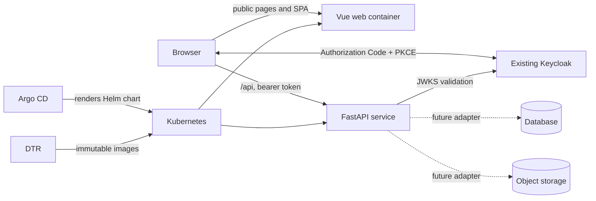

# Architecture

## System shape

The ingress sends `/api` and `/health` to FastAPI and all other paths to the Vue/Nginx
container. The API is the security and data boundary; the browser never talks directly
to a database or storage service.

## Module boundaries

### `apps/web`

- Vue 3, TypeScript, Vite, and Vue Router.
- Public landing content and the authenticated customer experience can evolve in one SPA.
- `oidc-client-ts` implements OIDC Authorization Code with PKCE.
- Runtime configuration is loaded from `/config.js`, mounted by Helm.
- Access tokens are kept in session storage and attached only to API requests.

### `apps/api`

- FastAPI with Pydantic settings.
- Public health endpoints and versioned customer endpoints under `/api/v1`.
- Access tokens are validated against Keycloak JWKS, issuer, signature, expiry, and API
  audience. UI route guards are convenience only; API authorization is authoritative.
- Database and object-storage adapters should be created behind service/repository
  interfaces when their requirements become clear.

### `deploy`

- One Helm chart owns both stateless workloads, services, ingress, configuration,
  autoscaling options, disruption budgets, probes, and security contexts.
- Small environment values files contain only differences.
- Argo CD Applications point to the chart and environment values in the same repository.
- Secrets are referenced, never generated or stored in Git by the chart.

## Evolution path

1. Keep the landing page and customer UI together until independent release cycles or
   teams justify splitting them.
2. Add API business modules by domain, not by transport (`customers`, `documents`, etc.).
3. Select persistence from access patterns. MongoDB is appropriate for evolving aggregate
   documents; PostgreSQL is usually stronger for relationships, reporting, and transactions.
4. Add a migration/index management strategy at the same time as the database driver.
5. Add object storage behind an adapter and issue short-lived signed URLs from the API.
6. Introduce a worker deployment only when background or retryable work appears.

## Decisions deferred on purpose

- Database engine and topology.
- Object-storage implementation.
- CI provider and pipeline syntax.
- Secrets operator or vault integration.
- Ingress controller-specific annotations and certificate issuer.
- Observability backend.

These depend on product or platform constraints and do not need to be baked into the
initial service boundaries.

